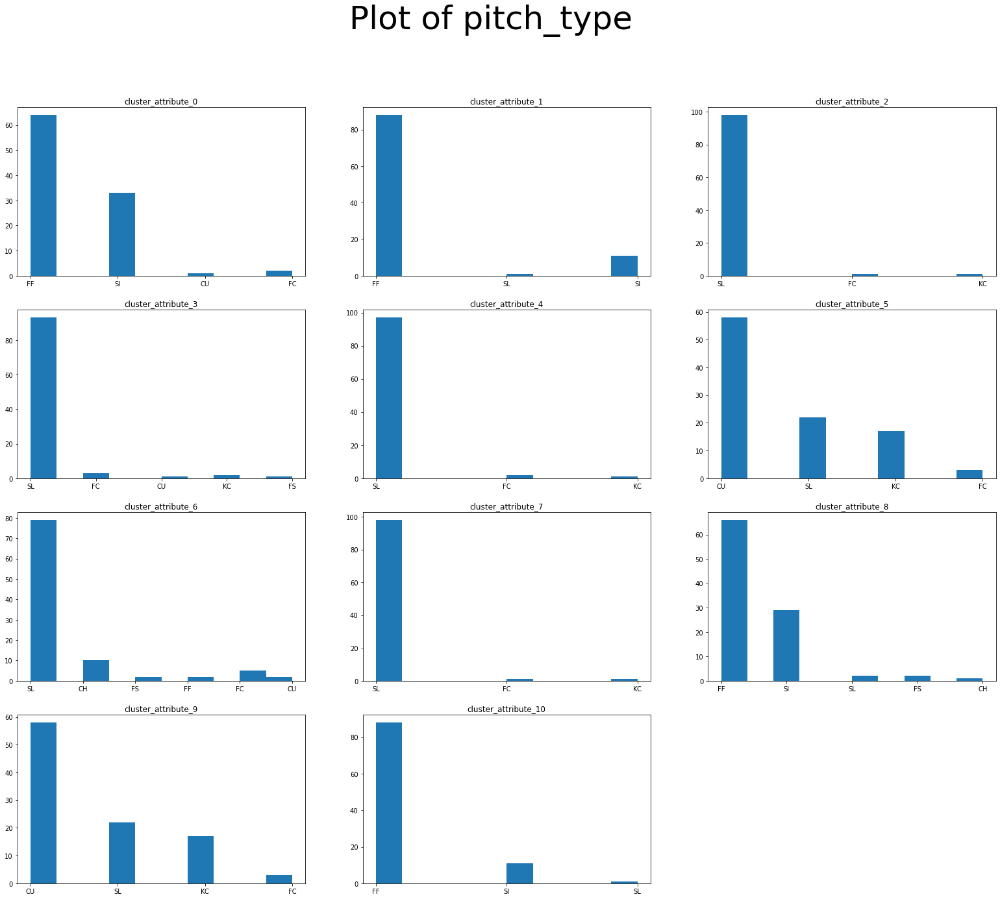
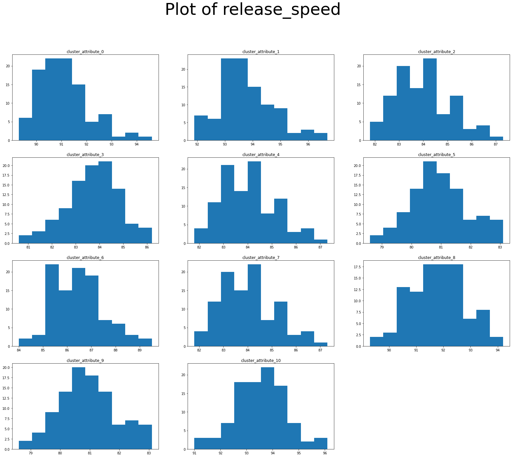
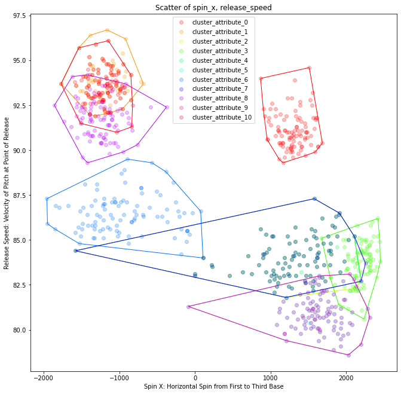
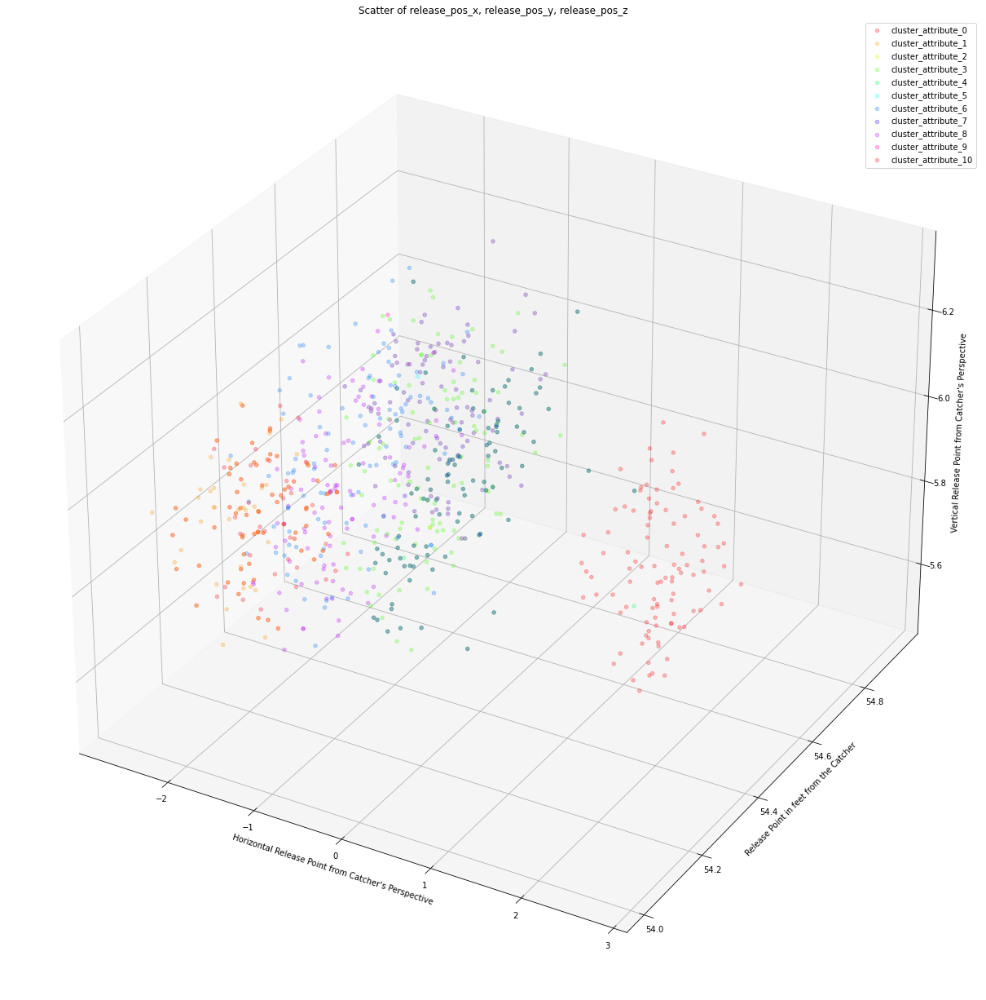
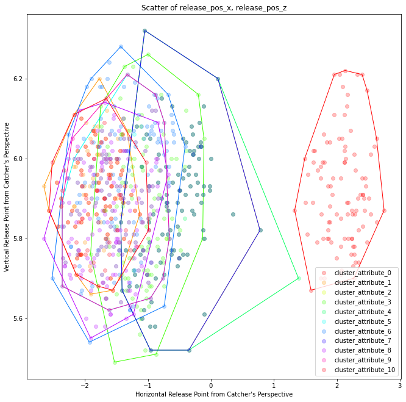
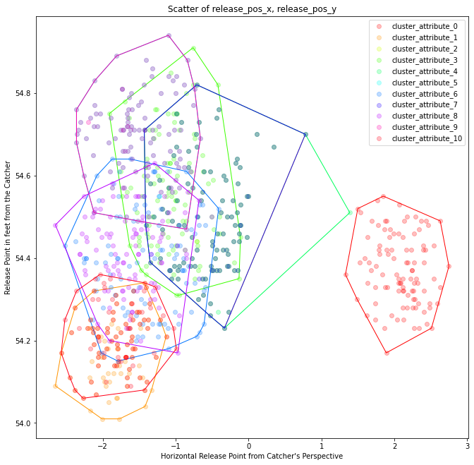
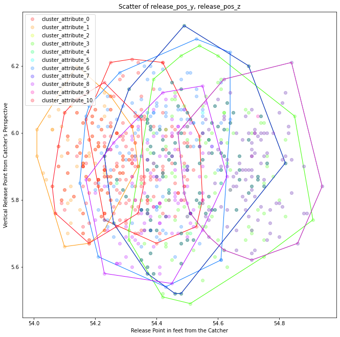

# MLB_xBA_Prediction

## Introduction

The purpose of this project is to perform expected Batting Average (xBA) prediction of MLB batters against a pitcher on some given day. This project is still in its initial stage of feature engineering using various machine learning models. 

The final project will involve predictions based on the recent performance of batters and pitchers, as well as matchup potential. This matchup potential will involve the use of Statcast pitch data, which involves 23 different metrics detailing the path of the pitched baseball, from the release point to when it crosses home plate. This data was standardized across all MLB ballparks in 2017.

## Purpose

The purpose of this project is to predict the expected batting average (xBA) of MLB players using recent performance. This includes making predictions for batters, pitchers, and matchup results. xBA was chosen instead of traditional batting average to respect the more probabilistic nature of hitting in baseball. xBA is largely considered a better indicator of batter and pitcher performance in an at bat instead of the more result oriented batting average, on-base percentage, strikeout rate, etc.

This project was restricted to regular season games, because much of the advanced variables (statcast, launch angle, hit velocity, xBA, etc.) is missing in spring training and exhibition games. Post-season games were removed to maintain a level of consistency.

## Tools Used

Python: This was the coding language used.
Principal Component Analysis (PCA): For dimensionality reduction of Statcast pitch data.
Fuzzy-C Means/K-Means Clustering: Used for clustering Statcast pitch data.
Random Forest Modeling: Used for final modeling and prediction.

## Data Cleaning

Missing xBA used the median of the hit type (single, double, etc.) by year. This was done to better capture changing philosophies for hitting. For rarer hit types, such as sacrifice bunt double play, the overall median was used to ensure that there is data to impute from.

Statcast spin-rate features were translated to euclidean geometry to ensure consistent orientation for pitching variables.

Missing Statcast data used Next Observation Carried Backward or Last Observation Carried Forward (attempted in that order using same day entries first) if all data was missing for that pitch or too much data to properly impute from was missing. This was done to better represent a pitcher's ability on that day. If only a few pieces of data were missing, the clusters for that pitcher was used to impute the missing data.

## Process

In order to better prepare for matchup based predictions, pitchers' pitches were clustered and categorized based on publicly available Statcast data. All pitchers were individually clustered using k-means to better find the ideal pitches in that pitcher's repertoire. This was done in order to separate the pitch classifier (cureveball, slider, cutter, etc.) from the types of pitches thrown. This would represent the ideal pitches each type of pitcher can throw. Each of these "ideal pitches" was then clustered again, to better represent all pitches thrown. Principal component analysis (PCA) was used for dimensionality reduction, and fuzzy-c means was used so that soft and hard clustering was made available. Hard clustering (using the highest correlation to a specific cluster) yields the same result as k-means. Silhouette score was used to determine clusters. While there are better methods to be used, this was meant to quickly perform clustering for all pitchers, and make updating overall clusters easier.

For prediction, random forest models were used. Boosting algorithms such as XGBoost, AdaBoost, CatBoost, and LightGBM were all tested with minimal improvements over random forest, and so all results detailed below are using random forest. For features: rolling averages of xBA, strikeout, and walks were used for batter and pitcher models. Matchup models also included pitcher use of clustered pitch types (hard and soft) and batter performance against each pitch cluster. To calculate batter performance against each pitch type, the final pitch of each at-bat would contribute the resulting xBA to the identified pitch cluster. This is the same method used in publicly available MLB statistics regarding player performance against pitch type.

## Evaluation of Models

The metrics listed below are as follows

* mae: mean absolute error
* mse: mean squared error
* wmae: weighted mean absolute error

"wmae" is weighted by the number of plate appearances contained by that player. The more plate appearances contained in that player's appearances for the day, the more heavily it is weighted in the mean absolute error calculation.

This weighted version attempts to acknowledge the inherently random nature of performance for hitting a baseball over the course of so few plate appearances and the small differences in where a baseball is hit, which has a high effect on quality of contact.

While this is good for batters, who normally encounter between 1 and 4 plate appearances in a game based on role and position in the batting order, this could negatively affect pitcher evaluation based on this metric. That is because it weighs starting pitchers much more heavily than relief pitchers, although relief pitchers are generally viewed as much more volatile in terms of performance over the course of an entire season.

The models evaluated are listed below:

* batter: This is a Random Forest Model built on past performance from batters. Pitchers are not taken into account. Rolling xBA, strikeouts, and walks are the model features.
* pitcher: This is a Random Forest Model built on past performance from pitchers. Batters are not taken into account. Rolling xBA, strikeouts, walks, and past pitch data.
* matchup: This model is a Random Forest Model built on matchup specific performance of pitchers and batters. Rolling xBA, strikeouts, and walks of both players are taken into account. The past pitch data of pitchers and batter recent performance against all pitch types are also taken into account.
* combined: This model is a Random Forest Model built on matchup specific performance of pitchers and batters. The predicted values from the batter and pitcher models are included with the pitcher's pitch data, along with the the past pitch data of pitchers and batterrecent performance against all pitch types.
* stacked: This model is a Random Forest Model built on matchup specific performance of pitchers and batters. The predicted values from the batter, pitcher, and matchup models are used to make this prediction.

### Train Dataset Evaluation (2017-2021 Seasons)

### Test Dataset Evaluation (2022 Season)

## Cluster Analysis

Each cluster is represented by the n=150 closest cluster points to the cluster center.

The clusters could use improvement. It has little representation of left-handed pitchers in the available clusters. Adding a separate variable for pitcher and batter handedness in the final model could solve some issues in the matchup, combined, and stacked models. However, this would be a way to bypass poor clustering, which could more effectively improve model performance with improvements.

### Histogram: Plots of Feature by Cluster

Shows the representation of pitch type in each cluster.

Displays the handedness of the pitcher in each cluster.

Displays the release velocity of each pitch in each cluster.

Displays the effective speed of each pitch in each cluster. This is a calculation done involving velocity taken at 3 point in a pitch's travel to home plate and the release point, drepresenting a percieved speed of the pitch to the batter.

### Scatter of Velocity, Spin x, and Spin z

release_speed = velocity of baseball as it leaves the release point of the pitcher
spin_x = spin rate in direction of first to third base (vertical axis)
spin_z = spin rate in direction of pitcher mound to home plate (horizontal axis from first to third)

The spin will translate to movement in the opposite direction.

### Scatter of Release Point

release_pos_x = Horizontal Release Point from catcher perspective
release_pos_y = Release point in feet from catcher
release_pos_z = Vertical Release Point from catcher perspective

Release Point from the Catcher's Point of View

Release Point from Above Point of View

Release Point from First Base Point of View

## Project Use

For a fresh file run (which will take a long time with the unoptimized code), run the "fresh_setup.py". If a player map for ids is desired - this will increase run time due to delay between runs (web scraping practice) - make sure to uncomment the line in the code.

All files related to the processes is stored in the 'libs' directory.

'cluster_analysis.ipynb' and 'result_exploration.ipynb' are built to provide feedback in a way that requires no additional coding. 

The ability for project updating will be included at a later date. The code is currently focusing on achieving results with the data currently held for it.

## To Do List

Future improvements that are planned to be added include:

* Cluster optimization to improve matchup model results.
* Add the ability to introduce weight to pitches in an at bat for batter performance calculation. Currently, only the final pitch in the at bat is used.
* Implement better and faster code for initial file preparation.
* Introduce new models to test against the current models in place.
* Enable the project to update the information it has stored in terms of game files (code is in place, but the environment is not).

## Resources

The framework for retrieving the data (get_data.py) was based on the code found at the following github location: https://github.com/alanrkessler/savantscraper/blob/master/savantscraper.py

I do not own any of the game file data, which is all publicly available from the BaseballSavant API and belongs to the MLB.

