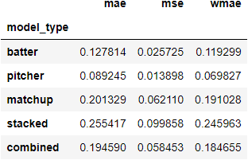

# MLB_xBA_Prediction

## Introduction

The purpose of this project is to perform expected Batting Average (xBA) prediction of MLB batters against a pitcher on some given day. This project is still in its initial stage of feature engineering using various machine learning models. 

The final project will involve predictions based on the recent performance of batters and pitchers, as well as matchup potential. This matchup potential will involve the use of Statcast pitch data, which involves 23 different metrics detailing the path of the pitched baseball, from the release point to when it crosses home plate. This data was standardized across all MLB ballparks in 2017.

## Evaluation of Models

The metrics listed below are as follows

* mae: mean absolute error
* mse: mean squared error
* wmae: weighted mean absolute error

"wmae" is weighted by the number of plate appearances contained by that player. The more plate appearances contained in that player's appearances for the day, the more heavily it is weighted in the mean absolute error calculation.

This weighted version attempts to acknowledge the inherently random nature of performance for hitting a baseball over the course of so few plate appearances and the small differences in where a baseball is hit, which has a high effect on quality of contact.

While this is good for batters, who normally encounter between 1 and 4 plate appearances in a game based on role and position in the batting order, this could negatively affect pitcher evaluation based on this metric. That is because it weighs starting pitchers much more heavily than relief pitchers, although relief pitchers are generally viewed as much more volatile in terms of performance over the course of an entire season.

The models evaluated are listed below:

* batter: This is a Random Forest Model built on past performance from batters. Pitchers are not taken into account. Rolling xBA, strikeouts, and walks are the model features.
* pitcher: This is a Random Forest Model built on past performance from pitchers. Batters are not taken into account. Rolling xBA, strikeouts, walks, and past pitch data.
* matchup: This model is a Random Forest Model built on matchup specific performance of pitchers and batters. Rolling xBA, strikeouts, and walks of both players are taken into account. The past pitch data of pitchers and batter recent performance against all pitch types are also taken into account.
* combined: This model is a Random Forest Model built on matchup specific performance of pitchers and batters. The predicted values from the batter and pitcher models are included with the pitcher's pitch data, along with the the past pitch data of pitchers and batterrecent performance against all pitch types.
* stacked: This model is a Random Forest Model built on matchup specific performance of pitchers and batters. The predicted values from the batter, pitcher, and matchup models are used to make this prediction.

### Train Dataset Evaluation (2017-2021 Seasons)

### Test Dataset Evaluation (2023 Season)

## Project Use

For a fresh file run (which will take a long time with the unoptimized code), run the "fresh_setup.py". If a player map for ids is desired - this will increase run time due to delay between runs (web scraping practice) - make sure to uncomment the line in the code.

All files related to the processes is stored in the 'libs' directory.

'cluster_analysis.ipynb' and 'result_exploration.ipynb' are built to provide feedback in a way that requires no additional coding. 

The ability for project updating will be included at a later date. The code is currently focusing on achieving results with the data currently held for it.

## To Do List

Future improvements that are planned to be added include:

* Cluster optimization to improve matchup model results.
* Add the ability to introduce weight to pitches in an at bat for batter performance calculation. Currently, only the final pitch in the at bat is used.
* Implement better and faster code for initial file preparation.
* Introduce new models to test against the current models in place.
* Introduce updateable graphs to this README.md for easier result viewing of clustered pitches.
* Enable the project to update the information it has stored in terms of game files (code is in place, but the environment is not).

## Resources

The framework for retrieving the data (get_data.py) was based on the code found at the following github location: https://github.com/alanrkessler/savantscraper/blob/master/savantscraper.py

I do not own any of the game file data, which is all publicly available from the BaseballSavant API and belongs to the MLB.

